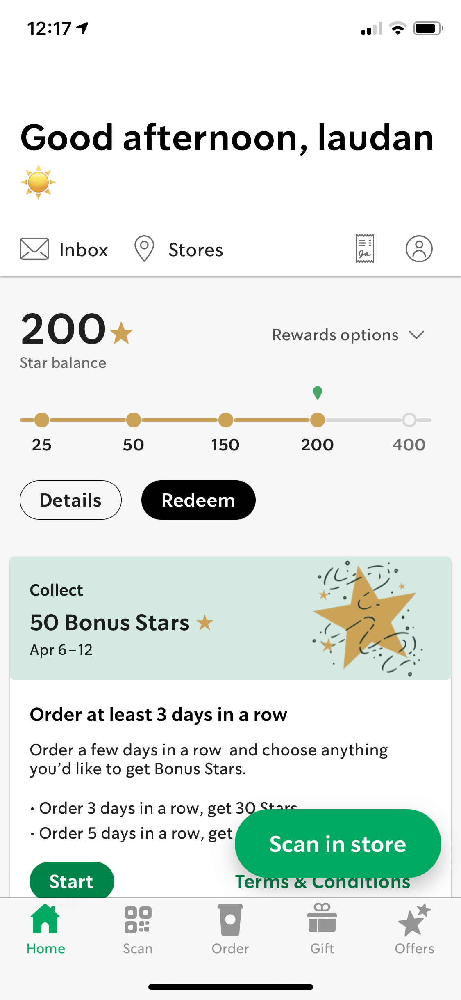

# Assignment 01: Heuristic Evaluation
## DH 110, Laudan Hosseini
This project is a heuristic evaluation for the apps "Audiobooks HQ" and "Starbucks". Here, we will go through all 10 heuristics and determine whether they are done effectively for each application. 

## App 01: Starbucks 

https://www.starbucks.com/ 

 

| Heuristics | Comments | Severity Rating | Improvements | 
| ---------- | -------- | --------------- | ------------ |
| 01: Visibility of System Status | Bad: Doesn't update us on our order after placing it and oftentime gives the wrong time estimates on when orders will be ready. Good: Has prominent loading icons for refreshing the page or when switching to another page.  |  2 | Give more accurate estimates on updating the user on when the order is going to be ready and/or if there are delays. Maybe including a step by step update (similar to Dominos) will be a good idea. | 
| 02: Match between system and real world | Good: Uses a lot of symbols that correspond to its meaning; for example, using coffee cup as the "order" tab, using a home for the "home" tab, using a QR code symbol as the "scan" tab. Bad: A lot of users can be confused on what the "Rewards" program is, and it includes a lot of jargon related to the rewards program throughout the app. | 1 | Maybe making the "Offers" tab more clearly targeted towards the reward program would make it more clear to users what the stars mean + what they can do for you. |  
| 03: User control and freedom | Bad: Doesn't have an undo button for orders (unlike the app for Philz coffee, for instance, which has a 30 secnd countdown to cancel an order immediately after) + confirms the Starbucks location for the order only sometimes | 3 | Similar to heurisitc 1, making the cancellation for orders more prominent, such as by having a countdown of cancelling the order with no penalties. Also, it would help to make the location confirmations more consistent. | 
| 04: Consistency and Standards | Good: All of the confirmation, submission, and order buttons are green + all of the rewards buttons are black | 1 | Similar to heuristic 2, making the rewards program more clear on what the stars actually mean can help. There is not a lot of info given on this. | 
| 05: Error prevention | Good: Makes sure that we want to delete a credit card payment, makes sure we want to "discard changes" to any changes we made to our drink order, and makes sure we want to "save our changes" to a drink order when it is in our cart. | 1| Not a lot of improvements to be made here, as there are a lot of confirmation checks and the user is made sure of the changes he/she/they make to a drink. Only error preventions would relate to what was mentioned in number 01 and 03. | 
| 06: Recognition rather than recall | Bad: Doesn't allow us to search for particular locations. Good: Allows us to search for menu items, plus/minus signs for adding/removing something from a user's cart, heart symbols to favorite items. | 1 | Allow the user a search bar on the map to look for a particular location. | 
| 07: Flexibility and Efficiency | Good: Has a QR code scanner for quicker payments, has a prominent "Scan to Pay" button on the homepage to quickly access the QR code, has a favorites section and a History section for regular users to access their drinks quickly. Bad: App does not accurately update the nutrition information when changes to a drink are made. | 2 |  It would help users a lot to have a more accurate nutrition section to quickly see how the calories or sugar contents change based on changes made. | 
| 08: Aesthetic and minimalist design | Bad: Home page is pretty messy, has too much going on since it all contains the inbox, profile, recent updates, rewards, stores, and history. Has too many rewards buttons that make it more distracting. Overall lots of irrelevant details on certain pages. | 3 | It would help the user a lot when navigating the app to split the home page into a more organized format so it isn't as overwhelming to look at, especially the homepage is the first thing the user sees. | 
| 09: Help users recognize, diagnose, and recover from errors | Bad: Incorrectly informs users of errors with drinks; for instance, it warns the user that a particular drink is sold out at a store when it may actually not be. Also does not warn the user of another store where the drink can be bought if it is sold out. | 3 | It would be very important to fix this aspect of the app so that users can get the more accurate information on orders. This can be done by having more efficient algorithms to detect if things are really sold out or not. |
| 10: Help and Documentation | Good: There is a "Help" tab under settings with a search bar. Bad: No FAQ section, help bar does not provide great help (oftentimes, searching things up leads to no articles found). | 2 | It would be important to update the accuracy of the help search bar so that users can get more accurate instructions. Including a FAQ section could also help users find the answers faster. |

## App 02: AudioBooks HQ

https://www.audiobookshq.com/

